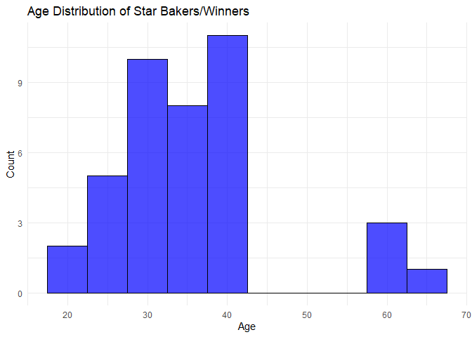
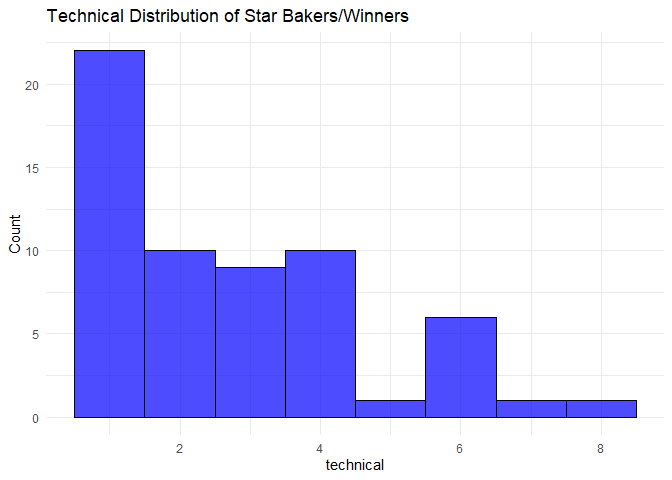

p8105_hw2_fl2714
================
Fangchi
2024-09-29

## Problem 1:NYC Transit data

### Read and clean the data

``` r
subway_data <- read.csv("data/NYC_Transit_Subway_Entrance_And_Exit_Data.csv")
```

``` r
colnames(subway_data)
```

    ##  [1] "Division"           "Line"               "Station.Name"      
    ##  [4] "Station.Latitude"   "Station.Longitude"  "Route1"            
    ##  [7] "Route2"             "Route3"             "Route4"            
    ## [10] "Route5"             "Route6"             "Route7"            
    ## [13] "Route8"             "Route9"             "Route10"           
    ## [16] "Route11"            "Entrance.Type"      "Entry"             
    ## [19] "Exit.Only"          "Vending"            "Staffing"          
    ## [22] "Staff.Hours"        "ADA"                "ADA.Notes"         
    ## [25] "Free.Crossover"     "North.South.Street" "East.West.Street"  
    ## [28] "Corner"             "Entrance.Latitude"  "Entrance.Longitude"
    ## [31] "Station.Location"   "Entrance.Location"

``` r
# Clean and transform the data
subway_df <- subway_data |>
  janitor::clean_names() |>  # Clean the column names to be consistent
  mutate( 
    # Convert entry to logical
    entry_logic = ifelse(entry == "YES", TRUE, ifelse(entry == "NO", FALSE, NA)),
    # Count number of non-missing routes (treating both NA and "" as missing)
    route_count = rowSums(!is.na(across(starts_with("route"))) & across(starts_with("route"), ~ . != ""))
  ) |>
  # Select only the relevant columns
  select(line, station_name, station_latitude, station_longitude, 
         route_count, entry_logic, vending, entrance_type, ada)
```

``` r
sapply(subway_df, class)
```

    ##              line      station_name  station_latitude station_longitude 
    ##       "character"       "character"         "numeric"         "numeric" 
    ##       route_count       entry_logic           vending     entrance_type 
    ##         "numeric"         "logical"       "character"       "character" 
    ##               ada 
    ##         "logical"

``` r
# Count missing values for each column
colSums(is.na(subway_df))
```

    ##              line      station_name  station_latitude station_longitude 
    ##                 0                 0                 0                 0 
    ##       route_count       entry_logic           vending     entrance_type 
    ##                 0                 0                 0                 0 
    ##               ada 
    ##                 0

``` r
summary(subway_df)
```

    ##      line           station_name       station_latitude station_longitude
    ##  Length:1868        Length:1868        Min.   :40.58    Min.   :-74.03   
    ##  Class :character   Class :character   1st Qu.:40.69    1st Qu.:-73.99   
    ##  Mode  :character   Mode  :character   Median :40.73    Median :-73.96   
    ##                                        Mean   :40.73    Mean   :-73.94   
    ##                                        3rd Qu.:40.77    3rd Qu.:-73.91   
    ##                                        Max.   :40.90    Max.   :-73.76   
    ##   route_count     entry_logic       vending          entrance_type     
    ##  Min.   : 1.000   Mode :logical   Length:1868        Length:1868       
    ##  1st Qu.: 1.000   FALSE:115       Class :character   Class :character  
    ##  Median : 2.000   TRUE :1753      Mode  :character   Mode  :character  
    ##  Mean   : 2.286                                                        
    ##  3rd Qu.: 3.000                                                        
    ##  Max.   :11.000                                                        
    ##     ada         
    ##  Mode :logical  
    ##  FALSE:1400     
    ##  TRUE :468      
    ##                 
    ##                 
    ## 

``` r
# enumerate categorical variables
table(subway_df$entry_logic)
```

    ## 
    ## FALSE  TRUE 
    ##   115  1753

``` r
table(subway_df$vending)
```

    ## 
    ##   NO  YES 
    ##  183 1685

``` r
table(subway_df$entrance_type)
```

    ## 
    ##      Door  Easement  Elevator Escalator      Ramp     Stair   Walkway 
    ##        81        91        49        28         3      1615         1

``` r
table(subway_df$ada)
```

    ## 
    ## FALSE  TRUE 
    ##  1400   468

### Data description

The data we have preprocessed has 1868 rows and 9 rows.

- **line** (`Character`): The subway line.
- **station_name** (`Character`): The name of the subway station.
- **station_latitude** (`Numeric`): range from 40.58 to 40.90, with a
  median at 40.73.
- **station_longitude** (`Numeric`): range from -74.03 to -73.76, with a
  median at -73.96.
- **route_count** (`Numeric`): The number of routes available at each
  station is between 1 to 11, with an average of 2.286.
- **entry_logic** (`Logical`): Whether is an entrance, 1753 are `TRUE`
  and 115 are `FALSE`.
- **vending** (`Character`): Vending availability at the station, 1685
  are `YES` and 183 are `NO`.
- **entrance_type** (`Character`): Type of entrance. This variable
  describes the type of entrance each station has.
- **ada** (`Logical`): Whether the station is ADA accessible. 468 are
  `TRUE` and 1400 are `FALSE`.

### Data cleaning steps

- 1.**Data retrieval**: read data from csv
- 2.**Clean Column Names**: Standardize column names
- 3.**Calculate Entry Logic**: Convert the entry variable from character
  to a logical variable
- 4.**Determine Route Count**: Compute routes served at each station by
  counting non-missing values of columns indicate routes
- 5.**Select Columns**: Select columns we need
- 6.**Data Validation**: Check missing values, data type, categorical
  variable values, etc.

The data is tidy for Exploratory Data Analysis since there’s no missing
values, no anomalies in the numerical or categorical variables, and
clear meanings for all columns

### Exploratory Data Analysis

``` r
distinct_stations <- subway_df %>%
  distinct(station_name, line) %>%
  nrow()

distinct_stations
```

    ## [1] 465

There are 465 distinct stations.

``` r
# Counting ADA compliant stations
ada_compliant_stations <- subway_df %>%
  filter(ada == TRUE) %>%
  distinct(station_name, line) %>%
  nrow()

# Output the number of ADA compliant stations
ada_compliant_stations
```

    ## [1] 84

84 stations are ADA compliant

``` r
# Proportion of non-vending entrances that allow entry
non_vending_proportion <- subway_df %>%
  filter(vending == "NO") %>%
  summarize(proportion = mean(entry_logic, na.rm = TRUE))

# Output the proportion
non_vending_proportion$proportion
```

    ## [1] 0.3770492

37.7% of station entrances / exits without vending allow entrance

``` r
head(subway_data)
```

    ##   Division     Line Station.Name Station.Latitude Station.Longitude Route1
    ## 1      BMT 4 Avenue      25th St         40.66040         -73.99809      R
    ## 2      BMT 4 Avenue      25th St         40.66040         -73.99809      R
    ## 3      BMT 4 Avenue      36th St         40.65514         -74.00355      N
    ## 4      BMT 4 Avenue      36th St         40.65514         -74.00355      N
    ## 5      BMT 4 Avenue      36th St         40.65514         -74.00355      N
    ## 6      BMT 4 Avenue      45th St         40.64894         -74.01001      R
    ##   Route2 Route3 Route4 Route5 Route6 Route7 Route8 Route9 Route10 Route11
    ## 1                                               NA     NA      NA      NA
    ## 2                                               NA     NA      NA      NA
    ## 3      R                                        NA     NA      NA      NA
    ## 4      R                                        NA     NA      NA      NA
    ## 5      R                                        NA     NA      NA      NA
    ## 6                                               NA     NA      NA      NA
    ##   Entrance.Type Entry Exit.Only Vending Staffing Staff.Hours   ADA ADA.Notes
    ## 1         Stair   YES               YES     FULL             FALSE          
    ## 2         Stair   YES               YES     NONE             FALSE          
    ## 3         Stair   YES               YES     FULL             FALSE          
    ## 4         Stair   YES               YES     FULL             FALSE          
    ## 5         Stair   YES               YES     FULL             FALSE          
    ## 6         Stair   YES               YES     FULL             FALSE          
    ##   Free.Crossover North.South.Street East.West.Street Corner Entrance.Latitude
    ## 1          FALSE            4th Ave          25th St     SE          40.66032
    ## 2          FALSE            4th Ave          25th St     SW          40.66049
    ## 3           TRUE            4th Ave          36th St     NW          40.65449
    ## 4           TRUE            4th Ave          36th St     NE          40.65436
    ## 5           TRUE            4th Ave          36th St     NW          40.65468
    ## 6           TRUE            4th Ave          45th St     NE          40.64939
    ##   Entrance.Longitude        Station.Location       Entrance.Location
    ## 1          -73.99795 (40.660397, -73.998091) (40.660323, -73.997952)
    ## 2          -73.99822 (40.660397, -73.998091) (40.660489, -73.998220)
    ## 3          -74.00450 (40.655144, -74.003549) (40.654490, -74.004499)
    ## 4          -74.00411 (40.655144, -74.003549) (40.654365, -74.004113)
    ## 5          -74.00431 (40.655144, -74.003549) (40.654676, -74.004306)
    ## 6          -74.00933 (40.648939, -74.010006) (40.649389, -74.009333)

``` r
# Filter rows where any Route1 to Route11 column contains "A"
a_train_data <- subway_data %>%
  janitor::clean_names() %>%
  filter(if_any(starts_with("Route"), ~ . == "A"))

distinct_a_train_stations <- a_train_data %>%
  distinct(station_name, line) %>%
  nrow()

ada_compliant_a_train_stations <- a_train_data %>%
  filter(ada == TRUE) %>%
  distinct(station_name, line) %>%
  nrow()


distinct_a_train_stations
```

    ## [1] 60

``` r
ada_compliant_a_train_stations
```

    ## [1] 17

60 distinct stations serve the A train, 17 are ADA compliant

## Problem 2: Mr. Trash Wheel dataset

### Read and clean the data

``` r
#Read and clean Mr. Trash Wheel data
mr_trash_wheel_df <- read_excel("data/202309 Trash Wheel Collection Data.xlsx",
                          sheet = "Mr. Trash Wheel",
                          range = cell_cols("A:N"),
                          col_names = TRUE,
                          trim_ws = TRUE,
                          skip = 1) %>%
  janitor::clean_names() %>% 
  filter(!is.na(dumpster)) %>%
  mutate(sports_balls = as.integer(round(sports_balls, 0)),
         csource = "Mr. Trash Wheel")
```

``` r
# Check if sports_balls column exists and mutate only if it does
prof_trash_wheel_df <- read_excel("data/202309 Trash Wheel Collection Data.xlsx",
                          sheet = "Professor Trash Wheel",
                          range = cell_cols("A:M"),
                          col_names = TRUE,
                          trim_ws = TRUE,
                          skip = 1) %>%
  janitor::clean_names() %>%
  filter(!is.na(dumpster)) %>%
  # Conditionally mutate sports_balls if the column exists
  mutate(sports_balls = if ("sports_balls" %in% colnames(.)) as.integer(round(sports_balls, 0)) else NA_integer_,
         csource = "Professor Trash Wheel")
```

``` r
# Check if sports_balls column exists and mutate only if it does
gwynnda_trash_wheel_df <- read_excel("data/202309 Trash Wheel Collection Data.xlsx",
                          sheet = "Gwynnda Trash Wheel",
                          range = cell_cols("A:L"),
                          col_names = TRUE,
                          trim_ws = TRUE,
                          skip = 1) %>%
  janitor::clean_names() %>%
  filter(!is.na(dumpster)) %>%
  # Conditionally mutate sports_balls if the column exists
  mutate(sports_balls = if ("sports_balls" %in% colnames(.)) as.integer(round(sports_balls, 0)) else NA_integer_,
         csource = "Gwynnda Trash Wheel")
```

``` r
#year as character
mr_trash_wheel_df <- mr_trash_wheel_df %>%
  mutate(year = as.character(year))

prof_trash_wheel_df <- prof_trash_wheel_df %>%
  mutate(year = as.character(year))

gwynnda_trash_wheel_df <- gwynnda_trash_wheel_df %>%
  mutate(year = as.character(year))

# combine
combined_trash_wheel_df <- bind_rows(mr_trash_wheel_df, prof_trash_wheel_df, gwynnda_trash_wheel_df)
```

### Exploratory Data Analysis

``` r
summary(combined_trash_wheel_df)
```

    ##     dumpster      month               year          
    ##  Min.   :  1   Length:845         Length:845        
    ##  1st Qu.: 71   Class :character   Class :character  
    ##  Median :162   Mode  :character   Mode  :character  
    ##  Mean   :223                                        
    ##  3rd Qu.:373                                        
    ##  Max.   :584                                        
    ##                                                     
    ##       date                         weight_tons    volume_cubic_yards
    ##  Min.   :1900-01-20 00:00:00.00   Min.   :0.610   Min.   : 5.00     
    ##  1st Qu.:2017-06-21 00:00:00.00   1st Qu.:2.490   1st Qu.:15.00     
    ##  Median :2019-10-25 00:00:00.00   Median :3.070   Median :15.00     
    ##  Mean   :2019-06-08 04:53:06.75   Mean   :3.009   Mean   :15.13     
    ##  3rd Qu.:2021-11-04 00:00:00.00   3rd Qu.:3.540   3rd Qu.:15.00     
    ##  Max.   :2023-06-30 00:00:00.00   Max.   :5.620   Max.   :20.00     
    ##                                                                     
    ##  plastic_bottles  polystyrene    cigarette_butts  glass_bottles   
    ##  Min.   :   0    Min.   :    0   Min.   :     0   Min.   :  0.00  
    ##  1st Qu.:1000    1st Qu.:  280   1st Qu.:  3200   1st Qu.: 10.00  
    ##  Median :1980    Median :  950   Median :  5500   Median : 18.00  
    ##  Mean   :2296    Mean   : 1631   Mean   : 15592   Mean   : 20.89  
    ##  3rd Qu.:2900    3rd Qu.: 2400   3rd Qu.: 16000   3rd Qu.: 28.00  
    ##  Max.   :9830    Max.   :11528   Max.   :310000   Max.   :110.00  
    ##  NA's   :1       NA's   :1       NA's   :1        NA's   :156     
    ##   plastic_bags      wrappers      sports_balls   homes_powered  
    ##  Min.   :    0   Min.   :  180   Min.   : 0.00   Min.   : 0.00  
    ##  1st Qu.:  280   1st Qu.:  840   1st Qu.: 6.00   1st Qu.:37.83  
    ##  Median :  680   Median : 1380   Median :11.00   Median :49.50  
    ##  Mean   : 1082   Mean   : 2330   Mean   :13.17   Mean   :45.87  
    ##  3rd Qu.: 1400   3rd Qu.: 2635   3rd Qu.:18.25   3rd Qu.:57.50  
    ##  Max.   :13450   Max.   :20100   Max.   :56.00   Max.   :93.67  
    ##  NA's   :1       NA's   :118     NA's   :261     NA's   :2      
    ##    csource         
    ##  Length:845        
    ##  Class :character  
    ##  Mode  :character  
    ##                    
    ##                    
    ##                    
    ## 

The combined dataset contains data from three trash wheels: Mr. Trash
Wheel, Professor Trash Wheel, and Gwynnda Trash Wheel, with a total of
845 observations. Each observation represents a time when one of the
trash wheels was active, collecting various types of trash. Key
variables include `weight_tons`, representing the total weight of trash
collected (in tons), `plastic_bottles` indicating the number of plastic
bottles collected, and `cigarette_butts`, which tracks the number of
cigarette butts collected. For example, Professor Trash Wheel has
collected a total of 216.26 tons of trash. In June 2022, Gwynnda
collected 1.812^{4} cigarette butts. This dataset provides valuable
insights into the environmental impact of these trash wheels over time.

## Problem 3: Great British Bake Off

### Read and clean the data

``` r
# Read the data files
bakers <- read_csv("data/gbb_datasets/bakers.csv", locale = locale(encoding = "UTF-8"),show_col_types = FALSE) %>%
  janitor::clean_names()

bakes <- read_csv("data/gbb_datasets/bakes.csv", locale = locale(encoding = "UTF-8"),show_col_types = FALSE) %>%
  janitor::clean_names()

results <- read_csv("data/gbb_datasets/results.csv", 
                    locale = locale(encoding = "UTF-8"),
                    skip = 2,                
                    show_col_types = FALSE) %>%
           janitor::clean_names()

viewers <- read_csv("data/gbb_datasets/viewers.csv", locale = locale(encoding = "UTF-8"),show_col_types = FALSE) %>%
  janitor::clean_names()
```

``` r
bakers <- bakers %>%
  mutate(baker_name = tolower(baker_name),  
         baker = word(baker_name, 1))%>%
  mutate(baker = gsub('^"|"$', '', baker))       

bakes <- bakes %>%
  mutate(baker = tolower(baker))%>%
  mutate(baker = gsub('^"|"$', '', baker))

results <- results %>%
  mutate(baker = tolower(baker))%>%
  mutate(baker = gsub('^"|"$', '', baker))


dim(bakers)
```

    ## [1] 120   6

``` r
dim(bakes)
```

    ## [1] 548   5

``` r
dim(results)
```

    ## [1] 1136    5

``` r
names(bakers)
```

    ## [1] "baker_name"       "series"           "baker_age"        "baker_occupation"
    ## [5] "hometown"         "baker"

``` r
names(bakes)
```

    ## [1] "series"         "episode"        "baker"          "signature_bake"
    ## [5] "show_stopper"

``` r
names(results)
```

    ## [1] "series"    "episode"   "baker"     "technical" "result"

### Check for completeness

``` r
# Check if there are any bakers in the 'bakes' dataset that do not appear in the 'bakers' dataset.
anti_join(bakes, bakers, by = "baker")
```

    ## # A tibble: 0 × 5
    ## # ℹ 5 variables: series <dbl>, episode <dbl>, baker <chr>,
    ## #   signature_bake <chr>, show_stopper <chr>

``` r
# Check if there are any bakers in the 'bakers' dataset that do not appear in the 'bakes' dataset.
anti_join(bakers, bakes, by = "baker")
```

    ## # A tibble: 22 × 6
    ##    baker_name          series baker_age baker_occupation          hometown baker
    ##    <chr>                <dbl>     <dbl> <chr>                     <chr>    <chr>
    ##  1 alice fevronia          10        28 Geography teacher         Essex    alice
    ##  2 amelia lebruin          10        24 Fashion designer          Halifax  amel…
    ##  3 antony amourdoux         9        30 Banker                    London   anto…
    ##  4 briony williams          9        33 Full-time parent          Bristol  brio…
    ##  5 dan beasley-harling      9        36 Full-time parent          London   dan  
    ##  6 dan chambers            10        32 Support worker            Rotherh… dan  
    ##  7 helena garcia           10        40 Online project manager    Leeds    hele…
    ##  8 henry bird              10        20 Student                   Durham   henry
    ##  9 imelda mccarron          9        33 Countryside recreation o… County … imel…
    ## 10 jamie finn              10        20 Part-time waiter          Surrey   jamie
    ## # ℹ 12 more rows

``` r
# Check if there are any bakers in the 'results' dataset that do not appear in the 'bakers' dataset.
anti_join(results, bakers, by = "baker")
```

    ## # A tibble: 8 × 5
    ##   series episode baker  technical result    
    ##    <dbl>   <dbl> <chr>      <dbl> <chr>     
    ## 1      2       1 joanne        11 IN        
    ## 2      2       2 joanne        10 IN        
    ## 3      2       3 joanne         1 IN        
    ## 4      2       4 joanne         8 IN        
    ## 5      2       5 joanne         6 IN        
    ## 6      2       6 joanne         1 STAR BAKER
    ## 7      2       7 joanne         3 IN        
    ## 8      2       8 joanne         1 WINNER

``` r
# Check if there are any bakers in the 'bakers' dataset that do not appear in the 'results' dataset.
anti_join(bakers, results, by = "baker")
```

    ## # A tibble: 1 × 6
    ##   baker_name  series baker_age baker_occupation hometown     baker
    ##   <chr>        <dbl>     <dbl> <chr>            <chr>        <chr>
    ## 1 jo wheatley      2        41 Housewife        Ongar, Essex jo

``` r
# Check if there are any bakers in the 'bakes' dataset that do not appear in the 'results' dataset.
anti_join(bakes, results, by = c("baker","series"))
```

    ## # A tibble: 8 × 5
    ##   series episode baker signature_bake                               show_stopper
    ##    <dbl>   <dbl> <chr> <chr>                                        <chr>       
    ## 1      2       1 jo    Chocolate Orange CupcakesOrange and Cardamo… Chocolate a…
    ## 2      2       2 jo    Caramelised Onion, Gruyere and Thyme Quiche  Raspberry a…
    ## 3      2       3 jo    Stromboli flavored with Mozzarella, Ham, an… Unknown     
    ## 4      2       4 jo    Lavender Biscuits                            Blueberry M…
    ## 5      2       5 jo    Salmon and Asparagus Pie                     Apple and R…
    ## 6      2       6 jo    Rum and Raisin Baked Cheesecake              Limoncello …
    ## 7      2       7 jo    Raspberry & Strawberry Mousse Cake           Pain Aux Ra…
    ## 8      2       8 jo    Raspberry and Blueberry Mille Feuille        Mini Victor…

``` r
# Check if there are any bakers in the 'results' dataset that do not appear in the 'bakes' dataset.
anti_join(results, bakes, by = c("baker","series"))
```

    ## # A tibble: 258 × 5
    ##    series episode baker  technical result    
    ##     <dbl>   <dbl> <chr>      <dbl> <chr>     
    ##  1      2       1 joanne        11 IN        
    ##  2      2       2 joanne        10 IN        
    ##  3      2       3 joanne         1 IN        
    ##  4      2       4 joanne         8 IN        
    ##  5      2       5 joanne         6 IN        
    ##  6      2       6 joanne         1 STAR BAKER
    ##  7      2       7 joanne         3 IN        
    ##  8      2       8 joanne         1 WINNER    
    ##  9      9       1 antony        12 IN        
    ## 10      9       1 briony         2 IN        
    ## # ℹ 248 more rows

### Join datasets

``` r
# join bakes and bakers
bakes_bakers <- full_join(bakers, bakes,by = c("series","baker"))
# join bake_bakers with result
final_dataset <- full_join(bakes_bakers, results, by = c("baker", "series", "episode"))
```

``` r
# rearrange data
final_dataset <- final_dataset %>%
  select(series, episode, baker_name, baker, everything()) 

final_dataset <- final_dataset %>%
  arrange(series, episode, baker_name)
dim(final_dataset)
```

    ## [1] 1169   11

``` r
names(final_dataset)
```

    ##  [1] "series"           "episode"          "baker_name"       "baker"           
    ##  [5] "baker_age"        "baker_occupation" "hometown"         "signature_bake"  
    ##  [9] "show_stopper"     "technical"        "result"

``` r
head(final_dataset)
```

    ## # A tibble: 6 × 11
    ##   series episode baker_name         baker    baker_age baker_occupation hometown
    ##    <dbl>   <dbl> <chr>              <chr>        <dbl> <chr>            <chr>   
    ## 1      1       1 annetha mills      annetha         30 Midwife          Essex   
    ## 2      1       1 david chambers     david           31 Entrepreneur     Milton …
    ## 3      1       1 edd kimber         edd             24 Debt collector … Bradford
    ## 4      1       1 jasminder randhawa jasmind…        45 Assistant Credi… Birming…
    ## 5      1       1 jonathan shepherd  jonathan        25 Research Analyst St Alba…
    ## 6      1       1 lea harris         lea             51 Retired          Midloth…
    ## # ℹ 4 more variables: signature_bake <chr>, show_stopper <chr>,
    ## #   technical <dbl>, result <chr>

``` r
# Write final_dataset to a CSV file in the current working directory
write.csv(final_dataset, "final_bake_data.csv", row.names = FALSE)
```

Describe your data cleaning process, including any questions you have or
choices you made. Briefly discuss the final dataset.

- 1.Import files: The data files (bakers.csv, bakes.csv, results.csv,
  and viewers.csv) are imported and the columns are cleaned using
  janitor::clean_names().
- 2.Standardizing Baker Names: For each dataset (bakers, bakes, and
  results), the baker names are converted to lowercase.Baker’s name is
  extracted and assigned to the baker column, which align with other
  files.
- 3.Checking Completeness and Consistency: the results shows that bakes
  dataset does not include series 9 and 10.Additionally, there was a
  discrepancy with Joanne, who might have been referred to as “Jo” in
  some datasets, leading to mismatches. To avoid prematurely altering
  data, I chose to preserve the original data for further investigation
  into these inconsistencies.
- 4.  Final dataset description: The final dataset has 1,169 rows and 11
      columns, representing episodes from various seasons of the Great
      British Bake Off. Each row contains details about a contestant’s
      participation in a specific episode, including personal
      information (age, occupation, hometown) and their performance in
      the challenges (Signature Bake, Show Stopper, and Technical).This
      dataset can be used to analyze contestant performance trends,
      identify winning patterns, and examine how technical ranks relate
      to overall outcomes.

### Winner and Star bakers

``` r
# Filter the results dataset for Seasons 5 through 10 and episodes with Star Baker or Winner
star_bakers_winners <- final_dataset %>%
  filter(series >= 5 & series <= 10, result %in% c("STAR BAKER", "WINNER")) %>%
  select(series, episode, baker, baker_age, baker_occupation, hometown, signature_bake,show_stopper, technical,result)%>%
  arrange(series, episode)

library(knitr)
kable(star_bakers_winners, 
      caption = "Star Baker or Winner in Seasons 5 through 10")
```

| series | episode | baker | baker_age | baker_occupation | hometown | signature_bake | show_stopper | technical | result |
|---:|---:|:---|---:|:---|:---|:---|:---|---:|:---|
| 5 | 1 | nancy | 60 | Retired Practice Manager | Barton-upon-Humber, Lincolnshire | Coffee and Hazelnut Swiss Roll | Jaffa Orange Cakes | 1 | STAR BAKER |
| 5 | 2 | richard | 38 | Builder | Mill Hill, London | Rosemary Seeded Crackers | Pirates! | 1 | STAR BAKER |
| 5 | 3 | luis | 42 | Graphic Designer | Poynton, Cheshire | Opposites Attract Rolls | Roscón de Reyes | 2 | STAR BAKER |
| 5 | 4 | richard | 38 | Builder | Mill Hill, London | Black Forest Chocolate Fondants | Tiramisu Baked Alaska | 5 | STAR BAKER |
| 5 | 5 | kate | 41 | Furniture Restorer | Brighton, East Sussex | Rhubarb and Custard Tart | Rhubarb, Prune and Apple Pies | 3 | STAR BAKER |
| 5 | 6 | chetna | 35 | Fashion Designer | Broadstairs, Kent | Orange Savarin with Cinnamon Cream | Almond Liqueur Dobos Torte with Chocolate Caramel Buttercream | 2 | STAR BAKER |
| 5 | 7 | richard | 38 | Builder | Mill Hill, London | Minted Lamb Pasties | Stair of Éclairs |  |  |
| (Lavender and Blueberry & Rose and Raspberry Éclairs) | 1 | STAR BAKER |  |  |  |  |  |  |  |
| 5 | 8 | richard | 38 | Builder | Mill Hill, London | Fruit Swedish Tea Ring | Rhubarb and Custard and Toffee Apple Doughnuts | 4 | STAR BAKER |
| 5 | 9 | richard | 38 | Builder | Mill Hill, London | Rose and Pistachio BaklavaWalnut and Almond Baklava | Hazelnut Mocha EntremetsPink Grapefruit Entremets | 2 | STAR BAKER |
| 5 | 10 | nancy | 60 | Retired Practice Manager | Barton-upon-Humber, Lincolnshire | Apple and Lemon KitesRaspberry and Almond Croissants | Red Windmill | 1 | WINNER |
| 6 | 1 | marie | 66 | Retired | Auchterarder, Perthshire | Zingy Citrus Madeira Cake | A Walk in the Black Forest | 3 | STAR BAKER |
| 6 | 2 | ian | 41 | Travel photographer | Great Wilbraham, Cambridgeshire | Orange, Rosemary and Almond Biscotti | Sandwich de la Confiture | 3 | STAR BAKER |
| 6 | 3 | ian | 41 | Travel photographer | Great Wilbraham, Cambridgeshire | Wild Garlic Pesto Soda Breads | Flour Power | 1 | STAR BAKER |
| 6 | 4 | ian | 41 | Travel photographer | Great Wilbraham, Cambridgeshire | Pomegranate Two Ways Crème Brûlées | Trio of Spicy and Herby Baked Cheesecakes | 4 | STAR BAKER |
| 6 | 5 | nadiya | 30 | Full-time mother | Leeds / Luton | Naked Blueberry and Caraway Crunch Cake | Chocolate and Strawberry Lime Ice Cream Roll | 1 | STAR BAKER |
| 6 | 6 | mat | 37 | Fire fighter | London | Piña Colada Frangipane Tart | His ‘n’ Hers Vol-au-vents | 1 | STAR BAKER |
| 6 | 7 | tamal | 29 | Trainee anaesthetist | Manchester | Middle Eastern Game Pie | Spiced Blackberry, Raspberry and Cardamom Charlotte Russe | 3 | STAR BAKER |
| 6 | 8 | nadiya | 30 | Full-time mother | Leeds / Luton | Rose Pistachio and Mocha Hazelnut Horns | Bubble Gum and Peppermint Cream Religieuse à l’ancienne | 1 | STAR BAKER |
| 6 | 9 | nadiya | 30 | Full-time mother | Leeds / Luton | Peanut Salted Caramel and Chocolate Tart | Peacock in Nan’s Door | 4 | STAR BAKER |
| 6 | 10 | nadiya | 30 | Full-time mother | Leeds / Luton | Cardamom and Almond Buns & Nutmeg and Sour Cherry Fingers | My Big Fat British Wedding Cake | 1 | WINNER |
| 7 | 1 | jane | 61 | Garden designer | Beckenham | Lemon and Poppy Seed Drizzle Cake | Chocolate Orange Mirror Cake | 7 | STAR BAKER |
| 7 | 2 | candice | 31 | PE teacher | Barton-Le-Clay, Bedfordshire | Salted Caramel, Chocolate Iced Shiny Hearts | Gingerbread Pub with Sticky Ginger Carpet | 8 | STAR BAKER |
| 7 | 3 | tom | 26 | Project engagement manager | Rochdale | Chocolate Orange and Chilli Swirl Bread | Jörmungandr and Mjölnir | 4 | STAR BAKER |
| 7 | 4 | benjamina | 23 | Teaching assistant | South London | Red Onion Chutney, Brie and Bacon Yorkshire Puddings | Tropical Churros | 1 | STAR BAKER |
| 7 | 5 | candice | 31 | PE teacher | Barton-Le-Clay, Bedfordshire | Danish Pastry Croque Monsieur Kites and Cinnamon Apple, Vanilla Crème Rose Danish | Sausage, Black Pudding and Apple Rounds and Banoffee Whiskey Cups | 2 | STAR BAKER |
| 7 | 6 | tom | 26 | Project engagement manager | Rochdale | Blood Orange Halloween Pumpkin Pie | Floral Tea Cake | 1 | STAR BAKER |
| 7 | 7 | andrew | 25 | Aerospace engineer | Derby / Holywood, County Down | Tropical Holiday Roulade | Childhood Ice Cream Mousse Cakes | 1 | STAR BAKER |
| 7 | 8 | candice | 31 | PE teacher | Barton-Le-Clay, Bedfordshire | Cheesy Cheeky Fish Pies | Peacock | 1 | STAR BAKER |
| 7 | 9 | andrew | 25 | Aerospace engineer | Derby / Holywood, County Down | Cheesy Elephant Ears and Herby Treble Clefs | Philharmonic Fondants | 2 | STAR BAKER |
| 7 | 10 | candice | 31 | PE teacher | Barton-Le-Clay, Bedfordshire | Queen Victoria’s Mango and Strawberry Crown | Picnic for Pearly Kings and Queens | 2 | WINNER |
| 8 | 1 | steven | 34 | Marketer | Watford, Hertfordshire | Bonfire Night Cake | ‘A Baker’s Lunch’ Cake | 6 | STAR BAKER |
| 8 | 2 | steven | 34 | Marketer | Watford, Hertfordshire | Amarpressi Biscuits | ‘Check Bake’ Game | 6 | STAR BAKER |
| 8 | 3 | julia | 21 | Aviation Broker | Crawley, West Sussex | Earl Grey Dried Fruit Teacakes | ‘The Snail Under a Mushroom’ Bread Sculpture | 2 | STAR BAKER |
| 8 | 4 | kate | 29 | Health and safety inspector | Merseyside | Salted Bay Caramel Millionaire Shortbreads | Sticky Toffee Apple Caramel Cake | 6 | STAR BAKER |
| 8 | 5 | sophie | 33 | Former army officer and trainee stuntwoman | West Molesey, Surrey | Ginger, Fig and Honey Steamed School Pudding | Raspberry, Yuzu & White Chocolate Bûche Trifle Terrine | 1 | STAR BAKER |
| 8 | 6 | liam | 19 | Student | North London | ‘Standard FC’ Decorative Pies | ‘Nan’s Sunday Dinner’ Pie | 4 | STAR BAKER |
| 8 | 7 | steven | 34 | Marketer | Watford, Hertfordshire | Italian Style Cannoli | ‘Sicilian-style’ Sfogliatelle | 1 | STAR BAKER |
| 8 | 8 | stacey | 42 | Former school teacher | Radlett, Hertfordshire | Camembert & Onion and Apple & Blueberry Bedfordshire Clangers | ‘Bright’ Lemon & Orange Savoy Cake | 3 | STAR BAKER |
| 8 | 9 | sophie | 33 | Former army officer and trainee stuntwoman | West Molesey, Surrey | Strawberry & Rhubarb and Chestnut & Vanilla Choux Buns | ‘Tutu with Opera Filling’ Meringue Centrepiece | 1 | STAR BAKER |
| 8 | 10 | sophie | 33 | Former army officer and trainee stuntwoman | West Molesey, Surrey | Spelt Boules, Mushroom Ciabatta and Orange Plaited Brioche | ‘Ode to the Honey Bee’ Entremet | 2 | WINNER |
| 9 | 1 | manon | NA | NA | NA | NA | NA | 3 | STAR BAKER |
| 9 | 2 | rahul | NA | NA | NA | NA | NA | 2 | STAR BAKER |
| 9 | 3 | rahul | NA | NA | NA | NA | NA | 4 | STAR BAKER |
| 9 | 4 | dan | NA | NA | NA | NA | NA | 1 | STAR BAKER |
| 9 | 5 | kim-joy | NA | NA | NA | NA | NA | 4 | STAR BAKER |
| 9 | 6 | briony | NA | NA | NA | NA | NA | 1 | STAR BAKER |
| 9 | 7 | kim-joy | NA | NA | NA | NA | NA | 6 | STAR BAKER |
| 9 | 8 | ruby | NA | NA | NA | NA | NA | 3 | STAR BAKER |
| 9 | 9 | ruby | NA | NA | NA | NA | NA | 1 | STAR BAKER |
| 9 | 10 | rahul | NA | NA | NA | NA | NA | 2 | WINNER |
| 10 | 1 | michelle | NA | NA | NA | NA | NA | 6 | STAR BAKER |
| 10 | 2 | alice | NA | NA | NA | NA | NA | 1 | STAR BAKER |
| 10 | 3 | michael | NA | NA | NA | NA | NA | 6 | STAR BAKER |
| 10 | 4 | steph | NA | NA | NA | NA | NA | 1 | STAR BAKER |
| 10 | 5 | steph | NA | NA | NA | NA | NA | 4 | STAR BAKER |
| 10 | 6 | steph | NA | NA | NA | NA | NA | 3 | STAR BAKER |
| 10 | 7 | henry | NA | NA | NA | NA | NA | 3 | STAR BAKER |
| 10 | 8 | steph | NA | NA | NA | NA | NA | 4 | STAR BAKER |
| 10 | 9 | alice | NA | NA | NA | NA | NA | 4 | STAR BAKER |
| 10 | 10 | david | NA | NA | NA | NA | NA | 1 | WINNER |

Star Baker or Winner in Seasons 5 through 10

``` r
summary(star_bakers_winners)
```

    ##      series        episode        baker             baker_age    
    ##  Min.   : 5.0   Min.   : 1.0   Length:60          Min.   :19.00  
    ##  1st Qu.: 6.0   1st Qu.: 3.0   Class :character   1st Qu.:30.00  
    ##  Median : 7.5   Median : 5.5   Mode  :character   Median :33.50  
    ##  Mean   : 7.5   Mean   : 5.5                      Mean   :35.62  
    ##  3rd Qu.: 9.0   3rd Qu.: 8.0                      3rd Qu.:38.75  
    ##  Max.   :10.0   Max.   :10.0                      Max.   :66.00  
    ##                                                   NA's   :20     
    ##  baker_occupation     hometown         signature_bake     show_stopper      
    ##  Length:60          Length:60          Length:60          Length:60         
    ##  Class :character   Class :character   Class :character   Class :character  
    ##  Mode  :character   Mode  :character   Mode  :character   Mode  :character  
    ##                                                                             
    ##                                                                             
    ##                                                                             
    ##                                                                             
    ##    technical       result         
    ##  Min.   :1.00   Length:60         
    ##  1st Qu.:1.00   Class :character  
    ##  Median :2.00   Mode  :character  
    ##  Mean   :2.75                     
    ##  3rd Qu.:4.00                     
    ##  Max.   :8.00                     
    ## 

``` r
table(star_bakers_winners$baker_occupation)
```

    ## 
    ##                         Aerospace engineer 
    ##                                          2 
    ##                            Aviation Broker 
    ##                                          1 
    ##                                    Builder 
    ##                                          5 
    ##                           Fashion Designer 
    ##                                          1 
    ##                               Fire fighter 
    ##                                          1 
    ## Former army officer and trainee stuntwoman 
    ##                                          3 
    ##                      Former school teacher 
    ##                                          1 
    ##                           Full-time mother 
    ##                                          4 
    ##                         Furniture Restorer 
    ##                                          1 
    ##                            Garden designer 
    ##                                          1 
    ##                           Graphic Designer 
    ##                                          1 
    ##                Health and safety inspector 
    ##                                          1 
    ##                                   Marketer 
    ##                                          3 
    ##                                 PE teacher 
    ##                                          4 
    ##                 Project engagement manager 
    ##                                          2 
    ##                                    Retired 
    ##                                          1 
    ##                   Retired Practice Manager 
    ##                                          2 
    ##                                    Student 
    ##                                          1 
    ##                         Teaching assistant 
    ##                                          1 
    ##                       Trainee anaesthetist 
    ##                                          1 
    ##                        Travel photographer 
    ##                                          3

``` r
table(star_bakers_winners$hometown)
```

    ## 
    ##         Auchterarder, Perthshire     Barton-Le-Clay, Bedfordshire 
    ##                                1                                4 
    ## Barton-upon-Humber, Lincolnshire                        Beckenham 
    ##                                2                                1 
    ##            Brighton, East Sussex                Broadstairs, Kent 
    ##                                1                                1 
    ##             Crawley, West Sussex    Derby / Holywood, County Down 
    ##                                1                                2 
    ##  Great Wilbraham, Cambridgeshire                    Leeds / Luton 
    ##                                3                                4 
    ##                           London                       Manchester 
    ##                                1                                1 
    ##                       Merseyside                Mill Hill, London 
    ##                                1                                5 
    ##                     North London                Poynton, Cheshire 
    ##                                1                                1 
    ##           Radlett, Hertfordshire                         Rochdale 
    ##                                1                                2 
    ##                     South London           Watford, Hertfordshire 
    ##                                1                                3 
    ##             West Molesey, Surrey 
    ##                                3

``` r
# Load required libraries
library(ggplot2)

# Plot histogram for age distribution (assuming 'age' column exists)
ggplot(star_bakers_winners, aes(x = baker_age)) + 
  geom_histogram(binwidth = 5, fill = "blue", color = "black", alpha = 0.7) +
  labs(title = "Age Distribution of Star Bakers/Winners", x = "Age", y = "Count") +
  theme_minimal()
```

<!-- -->

``` r
# Plot histogram for age distribution (assuming 'age' column exists)
ggplot(star_bakers_winners, aes(x = technical)) + 
  geom_histogram(binwidth = 1, fill = "blue", color = "black", alpha = 0.7) +
  labs(title = "Technical Distribution of Star Bakers/Winners", x = "technical", y = "Count") +
  theme_minimal()
```

<!-- -->
Comment on this table – were there any predictable overall winners? Any
surprises?

- 1.  The table reveals a diverse set of winners and star bakers, with
      significant variation in their age, occupation, and hometown.
- 2.  Most of the winners achieved strong technical scores, with a
      median technical score of 2, indicating that lower technical
      scores (which reflect better performance) are common among the
      winners. This suggests that performing well in the technical
      challenge often increases the likelihood of winning.
- 3.  However, there are also some outliers—contestants who did not
      consistently excel in the technical challenge but still managed to
      win. This highlights that while technical performance is not the
      sole determinant.

### Veiwer data overview

``` r
summary(viewers, 10)
```

    ##     episode         series_1        series_2        series_3    
    ##  Min.   : 1.00   Min.   :2.240   Min.   :3.100   Min.   :3.850  
    ##  1st Qu.: 3.25   1st Qu.:2.638   1st Qu.:3.583   1st Qu.:4.603  
    ##  Median : 5.50   Median :2.875   Median :3.825   Median :4.765  
    ##  Mean   : 5.50   Mean   :2.770   Mean   :3.951   Mean   :5.001  
    ##  3rd Qu.: 7.75   3rd Qu.:3.000   3rd Qu.:4.293   3rd Qu.:5.287  
    ##  Max.   :10.00   Max.   :3.030   Max.   :5.060   Max.   :6.740  
    ##                  NA's   :4       NA's   :2                      
    ##     series_4        series_5         series_6        series_7    
    ##  Min.   :6.600   Min.   : 8.510   Min.   :11.09   Min.   :13.01  
    ##  1st Qu.:6.853   1st Qu.: 9.087   1st Qu.:11.71   1st Qu.:13.16  
    ##  Median :7.245   Median :10.040   Median :12.18   Median :13.37  
    ##  Mean   :7.354   Mean   :10.039   Mean   :12.31   Mean   :13.56  
    ##  3rd Qu.:7.410   3rd Qu.:10.273   3rd Qu.:12.38   3rd Qu.:13.45  
    ##  Max.   :9.450   Max.   :13.510   Max.   :15.05   Max.   :15.90  
    ##                                                                  
    ##     series_8         series_9        series_10     
    ##  Min.   : 8.550   Min.   : 8.670   Min.   : 8.700  
    ##  1st Qu.: 8.627   1st Qu.: 8.910   1st Qu.: 8.965  
    ##  Median : 8.980   Median : 9.265   Median : 9.225  
    ##  Mean   : 9.017   Mean   : 9.298   Mean   : 9.242  
    ##  3rd Qu.: 9.180   3rd Qu.: 9.537   3rd Qu.: 9.370  
    ##  Max.   :10.040   Max.   :10.340   Max.   :10.050  
    ## 

``` r
dim(viewers)
```

    ## [1] 10 11

``` r
head(viewers,10)
```

    ## # A tibble: 10 × 11
    ##    episode series_1 series_2 series_3 series_4 series_5 series_6 series_7
    ##      <dbl>    <dbl>    <dbl>    <dbl>    <dbl>    <dbl>    <dbl>    <dbl>
    ##  1       1     2.24     3.1      3.85     6.6      8.51     11.6     13.6
    ##  2       2     3        3.53     4.6      6.65     8.79     11.6     13.4
    ##  3       3     3        3.82     4.53     7.17     9.28     12.0     13.0
    ##  4       4     2.6      3.6      4.71     6.82    10.2      12.4     13.3
    ##  5       5     3.03     3.83     4.61     6.95     9.95     12.4     13.1
    ##  6       6     2.75     4.25     4.82     7.32    10.1      12       13.1
    ##  7       7    NA        4.42     5.1      7.76    10.3      12.4     13.4
    ##  8       8    NA        5.06     5.35     7.41     9.02     11.1     13.3
    ##  9       9    NA       NA        5.7      7.41    10.7      12.6     13.4
    ## 10      10    NA       NA        6.74     9.45    13.5      15.0     15.9
    ## # ℹ 3 more variables: series_8 <dbl>, series_9 <dbl>, series_10 <dbl>

``` r
# calculate average viewer
mean(viewers$series_1,na.rm=TRUE)
```

    ## [1] 2.77

``` r
mean(viewers$series_5,na.rm=TRUE)
```

    ## [1] 10.0393

The average viewer for Series 1 episodes is 2.77 million, while the
average viewer for Series 5 episodes is 10.04 million
